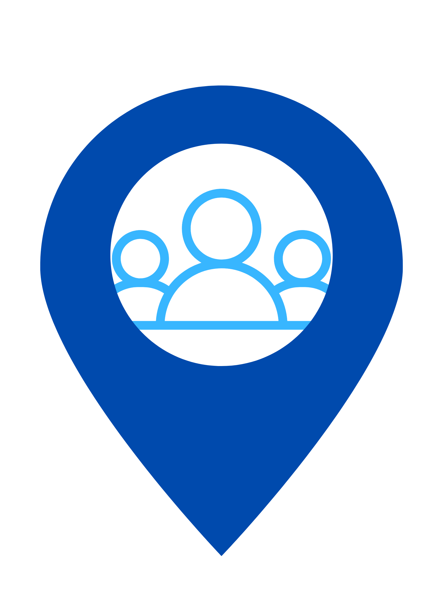

# HangoutApp

 

  

<h3 align="center">Hangout App</h3>

  

    Determine which friends are available to do something. Users are able to input their schedule and report their current status (busy, willing to do something, wanting to travel, etc).
     
    <a href="https://github.com/kenleyshaw/repo_name">View Demo</a>
    ·
    <a href="https://github.com/kenleyshaw/HangoutApp/issues">Report Bug</a>
    ·
    <a href="https://github.com/kenleyshaw/HangoutApp/issues">Request Feature</a>
  

  
Table of Contents

  <ol>
    <li>
      <a href="#about-the-project">About The Project</a>
      <ul>
        <li><a href="#built-with">Built With</a></li>
      </ul>
    </li>
    <li>
      <a href="#getting-started">Getting Started</a>
      <ul>
        <li><a href="#prerequisites">Prerequisites</a></li>
        <li><a href="#installation">Installation</a></li>
      </ul>
    </li>
    <li><a href="#usage">Usage</a></li>
    <li><a href="#roadmap">Roadmap</a></li>
    <li><a href="#contributing">Contributing</a></li>
    <li><a href="#license">License</a></li>
    <li><a href="#contact">Contact</a></li>
    <li><a href="#acknowledgments">Acknowledgments</a></li>
  </ol>

## About The Project

Determine which friends are available to do something. Users are able to input their schedule and report their current status (busy, willing to do something, wanting to travel, etc). 

Why not text your friends instead? Or check Facebook status? 
Hangout App makes it much easier to get an organized view of who is available without the hassle of keeping up with messages.

In this app, users can set their status depending on their availability in addition to viewing the status of their friends list. Add friends directly from your contacts

This project is an extension of a course project.

(<a href="#top">back to top</a>)

## Wireframing

### Built With

* React-native
* expo Go

(<a href="#top">back to top</a>)

## Getting Started
Navigate to the HangoutMobile repository

To set up the environment run
pip install -r requirements.txt

To install node 16 run 
curl -fsSL https://deb.nodesource.com/setup_16.x | sudo -E bash -
sudo apt install -y nodejs

You can check the installation with 
node -v
  8.15.0

npm -v
  v16.17.0

To start the frontend

cd frontend

npm install expo-cli
npm start

From here you can press 'w' to open the app in the browser or download the expo app to view it on mobile.

To start the backend in a new terminal navigate to the backend folder and run

python manage.py runserver 0.0.0.0:8000

Run the command ifconfig to determine your ip

In frontend/components/globalContext.js adjust the domain to your ip address
In backend/hangout_app/settings.py add the ip to the allowed hosts

### Prerequisites

to list things you need to use the software

### Installation

Install instructions here

(<a href="#top">back to top</a>)

## Usage

to add screenshots, code examples and demos

_For more examples, please refer to the [Documentation](https://example.com)_

(<a href="#top">back to top</a>)

## Roadmap

to add later:
- [ ] Feature 1
- [ ] Feature 2
- [ ] Feature 3
    - [ ] Nested Feature

(<a href="#top">back to top</a>)

## Contributing

Contributions are what make the open source community such an amazing place to learn, inspire, and create. Any contributions you make are **greatly appreciated**.

If you have a suggestion that would make this better, please fork the repo and create a pull request. You can also simply open an issue with the tag "enhancement".
Don't forget to give the project a star! Thanks again!

1. Fork the Project
2. Create your Feature Branch (`git checkout -b feature/AmazingFeature`)
3. Commit your Changes (`git commit -m 'Add some AmazingFeature'`)
4. Push to the Branch (`git push origin feature/AmazingFeature`)
5. Open a Pull Request

(<a href="#top">back to top</a>)

## License

Distributed under the MIT License. See `LICENSE.txt` for more information.

(<a href="#top">back to top</a>)

## Contact

Project Link: [https://github.com/kenleyshaw/HangoutApp](https://github.com/kenleyshaw/HangoutApp)

Email: hangoutappcpsc@gmail.com

(<a href="#top">back to top</a>)

## Acknowledgments

* Kenley Shaw
* Brad Sanders
* Noah Cooley-Cannon - Scrum Master
* Samuel Hagan

(<a href="#top">back to top</a>)

<!-- MARKDOWN LINKS & IMAGES -->
[contributors-shield]: https://img.shields.io/github/contributors/github_username/repo_name.svg?style=for-the-badge
[contributors-url]: https://github.com/github_username/repo_name/graphs/contributors
[forks-shield]: https://img.shields.io/github/forks/github_username/repo_name.svg?style=for-the-badge
[forks-url]: https://github.com/github_username/repo_name/network/members
[stars-shield]: https://img.shields.io/github/stars/github_username/repo_name.svg?style=for-the-badge
[stars-url]: https://github.com/github_username/repo_name/stargazers
[issues-shield]: https://img.shields.io/github/issues/github_username/repo_name.svg?style=for-the-badge
[issues-url]: https://github.com/github_username/repo_name/issues
[license-shield]: https://img.shields.io/github/license/github_username/repo_name.svg?style=for-the-badge
[license-url]: https://github.com/github_username/repo_name/blob/master/LICENSE.txt
[linkedin-shield]: https://img.shields.io/badge/-LinkedIn-black.svg?style=for-the-badge&logo=linkedin&colorB=555
[linkedin-url]: https://linkedin.com/in/linkedin_username
[product-screenshot]: images/screenshot.png
